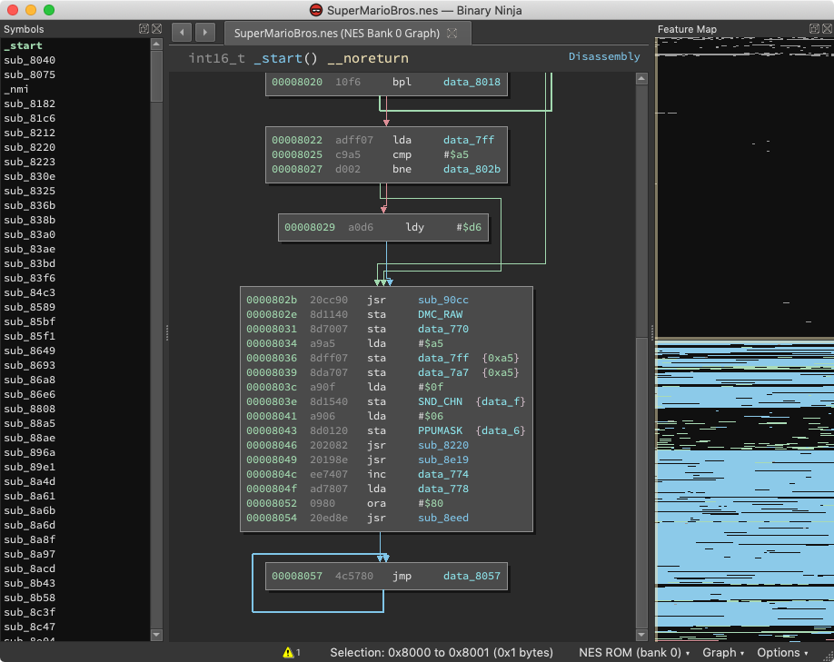

# 6502 Binary Ninja Plugin
Author: Vector35 Inc

This is an architecture plugin for [6502](https://en.wikipedia.org/wiki/MOS_Technology_6502) and binary view for NES roms.

## Required Dependencies

There are no external dependencies for this plugin.

## License

This plugin is released under a [MIT](https://github.com/Vector35/snippets/blob/master/LICENSE) license.